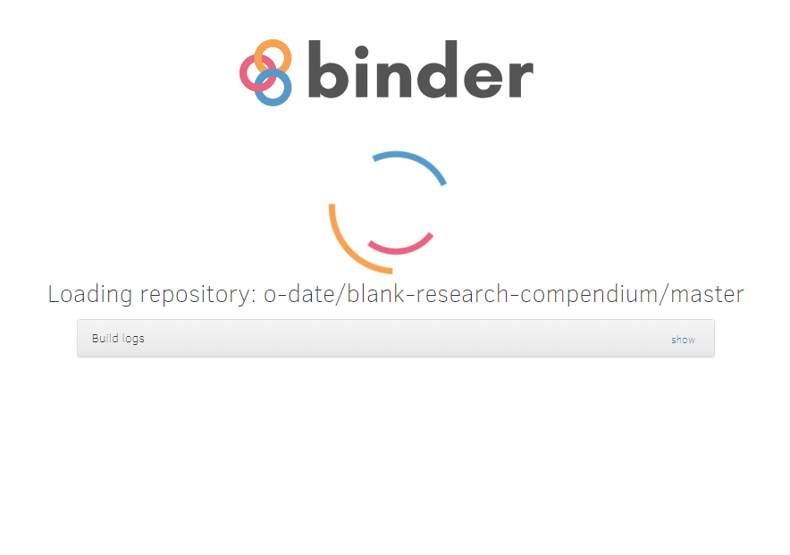
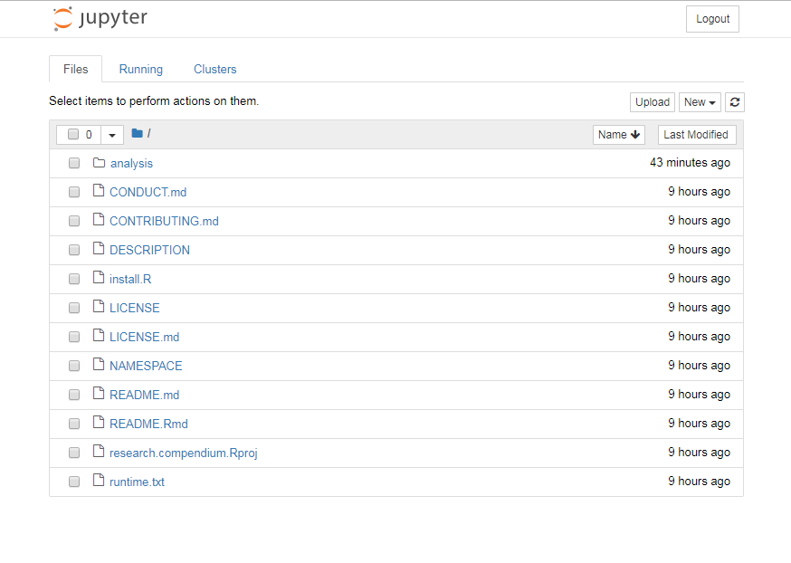
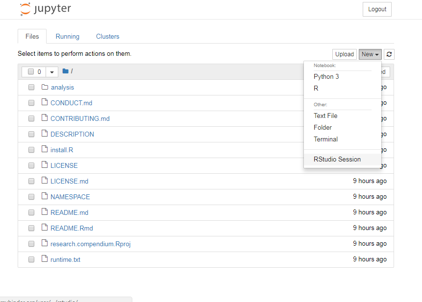
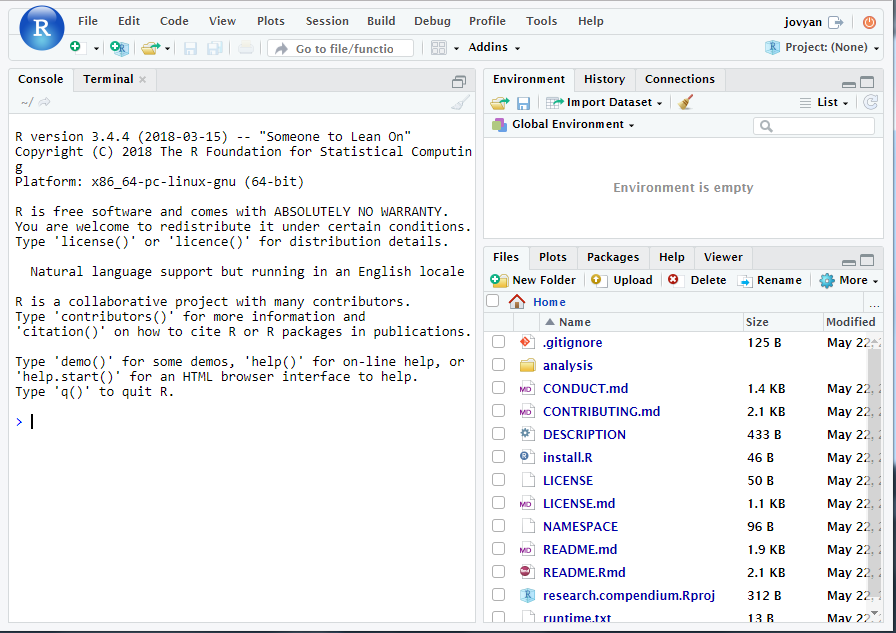

<!-- README.md is generated from README.Rmd. Please edit that file -->
What is this?
=============

This repository demonstrates how to combine a research compendium created by [rrtools](https://github.com/benmarwick/rrtools) with Binder, a service that creates an executable environment with RStudio in your browser. This means you can work on your compendium, writing the paper and code on any computer with a web browser and internet connection. This also makes your code immediately reproducible by anyone, anywhere.

How to try it out?
------------------

To try this yourself, [fork this repo](https://github.com/benmarwick/blank-research-compendium#fork-destination-box), then edit this README.Rmd file to edit the pink 'lauch binder' button in at the bottom of this readme so that it launches from your repository. Change it from:

`[](http://mybinder.org/v2/gh/benmarwick/blank-research-compendium/master)`

to replace benmarwick with your GitHub username:

`[](http://mybinder.org/v2/gh/yourusername/blank-research-compendium/master)`

Then commit and push this change to your GitHub repository, once it has updated, click on the pink 'launch binder' button in your README on your repository to start the Binder service in your browser. First you will see the loading screen, which looks like this:



Then you will see the file list for your Jupyter Notebook, something like this:



And from here you can start RStudio via the 'New' window, like this:



Now you have RStudio running in your browser, with all your files from your GitHub repository available to work on, like this:



You can work in RStudio, in your browser, and then use Git commands in the RStudio terminal to save your changes to your GitHub repository. Note that this is discouraged by the Binder developers because [they cannot guarantee the security of data moving through their service](https://mybinder.readthedocs.io/en/latest/faq.html#can-i-push-data-from-my-binder-session-back-to-my-repository)

Limitations
-----------

-   Binder is under active development and subject to breaking changes.
-   Binder is not suitable for big files and analyses involving big/long computes.
-   Binder gives you [1 GB RAM](https://mybinder.readthedocs.io/en/latest/faq.html#user-memory)
-   Binder will give you 12 hours of session time per user session, but will time-out after [10 min of inactivity](https://mybinder.readthedocs.io/en/latest/faq.html#how-long-will-my-binder-session-last)
-   The Binder developers recommend that you should [never share sensitive or personal information within a Binder repository](https://mybinder.readthedocs.io/en/latest/faq.html#how-secure-is-mybinder-org). This includes passwords, data that shouldn’t be public, API keys, etc.

How to use this with a research compendium?
===========================================

There are two ways to use Binder with a GitHub-hosted research compendium:

1.  Use Binder to write text and develop and run code in RStudio in your browser, and commit and push back to the repo to save your changes. This adds a lot of flexibility to working with research compendia because you don't need to install anything locally. If you do this, you should start by running `rrtools::use_compendium("pkgname")` and follow the rest ofthe [rrtools](https://github.com/benmarwick/rrtools) setup steps. However, the Binder developers discourage using passwords in Binder because they do no guarantee the security of data moving through their service.

2.  After development of research compendium is complete, and the paper is published, add a 'launch binder' button and the config files to the compendium repository on GitHub to enable others to explore the text and run the code in their browser. This is using Binder more like a display cabinet for the code, and you are not a risk of having your passwords exposed.

This section below is generated by `rrtools::use_readme_rmd()` and shows where to put the 'launch binder' button to invite users to explore your compendium:

My Research Compendium
======================

This repository contains the data and code for our paper:

> Authors, (YYYY). *Title of paper*. Name of journal/book <https://doi.org/xxx/xxx>

Our pre-print is online here:

> Authors, (YYYY). *Title of paper*. Name of journal/book, Accessed 22 May 2018. Online at <https://doi.org/xxx/xxx>

### How to cite

Please cite this compendium as:

> Authors, (2018). *Compendium of R code and data for 'Title of paper'*. Accessed 22 May 2018. Online at <https://doi.org/xxx/xxx>

### How to run download or install

You can run the code in this compendium in your browser using Binder: [](http://mybinder.org/v2/gh/benmarwick/blank-research-compendium/master)

You can download the compendium as a zip from from this URL: xxx

Or you can install this compendium as an R package, xxx, from GitHub with:

``` r
if (!require(devtools)) install.packages("devtools")
devtools::install_github("xxx/xxx")
```

### Licenses

**Text and figures :** [CC-BY-4.0](http://creativecommons.org/licenses/by/4.0/)

**Code :** See the [DESCRIPTION](DESCRIPTION) file

**Data :** [CC-0](http://creativecommons.org/publicdomain/zero/1.0/) attribution requested in reuse

### Contributions

We welcome contributions from everyone. Before you get started, please see our [contributor guidelines](CONTRIBUTING.md). Please note that this project is released with a [Contributor Code of Conduct](CONDUCT.md). By participating in this project you agree to abide by its terms.
